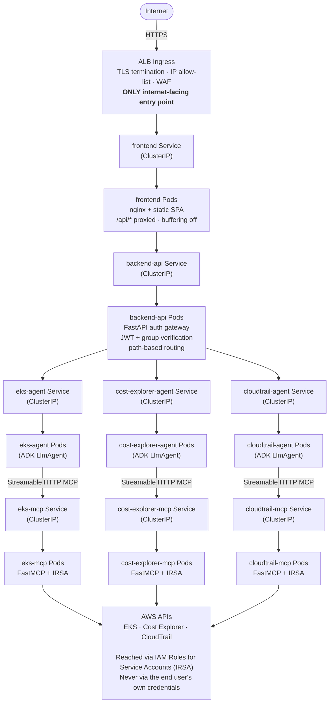

# Anatomy of a Streaming Chat Request: Browser, Nginx, Auth Gateway, Agents, and MCP

It's easy to describe this platform in one sentence: "a chat UI that talks to AI agents." The sentence hides five separate hops, each with its own auth, buffering, and failure behavior. When a demo works locally but streaming stutters or drops in the cluster, the bug is almost always at one of these boundaries — not in the model or the prompt.

This post walks the full path a single message takes, hop by hop. Deep dives on specific hops — SSO token handoff, tool-response token budgets — are covered in other posts in this series; this one is the map that shows how they connect.

---

## The Shape of One Request

```
Browser (React SPA + MSAL)
   │  Bearer token (header) or ?token= (SSE)
   ▼
Nginx (static assets + /api/* reverse proxy, buffering off)
   │
   ▼
Backend API — FastAPI auth gateway
   │  verify JWT + group membership, then re-forward original headers
   ▼
Agent service (Google ADK LlmAgent, one per domain)
   │  McpToolset over Streamable HTTP
   ▼
MCP server (FastMCP — AWS/Kubernetes calls via platform service account)
   │
   ▼
... same path in reverse, as an SSE stream the whole way back
```

Every arrow above is a place where buffering, auth, or session state can silently break the round trip. The rest of this post covers each one.

---

## How This Actually Runs in EKS

The logical flow above maps onto one EKS cluster and one namespace. Every component is its own Deployment + Service, deployed and scaled independently — there's no single monolithic pod doing all of this:




Three details in this topology matter as much as the request-hop mechanics do:

- **Only the frontend Service sits behind the ALB.** Every other Service — backend-api, each agent, each MCP server — is `ClusterIP`-only. Even though they're all in the same namespace, none of them are reachable from outside the cluster; the auth gateway is the only path in.
- **Each agent's Service uses `sessionAffinity: ClientIP` with an 8-hour timeout**, not round-robin load balancing. This exists because of the Hop 4 caveat below: an agent pod caches its MCP session on that specific process, so pinning a user's requests to the same pod for the life of a conversation avoids randomly landing on a replica with no matching session.
- **Agents, MCP servers, the backend gateway, and the frontend each deploy through their own independent CI/CD pipeline.** That independence is convenient for shipping small changes fast, but it's also exactly why the Hop 4 stale-MCP-session failure mode exists — a MCP Deployment can roll while its paired agent Deployment doesn't.

---




## Hop 1: Nginx — Static Assets and a Buffering-Off Proxy

The frontend container serves the compiled React SPA and reverse-proxies `/api/*` to the backend, per `frontend/nginx.conf`:

```nginx
location /api/ {
    proxy_pass http://backend-api.<namespace>.svc.cluster.local:8000/api/;
    proxy_http_version 1.1;
    proxy_set_header Host $http_host;
    proxy_buffering off;          # required for SSE — nginx must not batch chunks
    proxy_cache_bypass $http_upgrade;
    proxy_read_timeout 60s;
}

location / {
    try_files $uri $uri/ /index.html;   # SPA fallback for client-side routing
}
```

Two details matter more than they look:

- `proxy_buffering off` is not optional. With buffering on, nginx accumulates the backend's response and flushes it in one chunk — the client sees nothing until the whole SSE stream is done, defeating the point of streaming.
- The proxy target uses the in-cluster DNS name (`backend-api.<namespace>.svc.cluster.local`) in EKS, or the docker-compose service name locally. Nothing about the frontend build changes between environments — only how that hostname resolves.

Nginx never sees the JWT's contents; it just forwards the `Authorization` header (or query string) untouched to the backend.

---

## Hop 2: The Auth Gateway — Verify Once, Trust Downstream

`backend/api/auth_middleware.py` and `auth_routes.py` form a FastAPI gateway that sits between the frontend and every agent. It does two jobs: verify the token, and decide what that user is allowed to call.

**Token verification** (`auth_middleware.py`):
- Fetches Azure Entra ID's JWKS (`/discovery/v2.0/keys`) and caches it for an hour to survive key rotation without a fetch per request.
- Validates signature, issuer, audience, expiration — plus the `groups` claim, which carries **UUIDs**, not names, in v2.0 tokens.
- The token can arrive either as a `Authorization: Bearer` header (normal fetch calls) or as a `?token=` query parameter — because `EventSource`/streaming fetch clients can't attach custom headers after the connection opens, so SSE requests fall back to the query string.

**Authorization** is layered, not a single yes/no:

| Check | Source | Effect |
|---|---|---|
| `ALLOWED_GROUPS` | Any of 3 known Entra group UUIDs | Gatekeeper — reject anyone outside the platform entirely |
| `CLOUD_AGENT_GROUPS` | Subset of the above | Data developers are excluded from cost/EKS/CloudTrail agents |
| `AGENT_ALLOWED_ROLE_KEYS` | Per-agent role map | Data agents require data-developer or admin; other SSO agents accept any allowed role |

This is the only place group membership is checked. Once a request passes, the gateway **re-forwards the original headers unmodified** to the target agent — agents themselves never re-validate the JWT.

### How the Token Actually Gets Attached, Request by Request

There's no session cookie anywhere in this system — every single call to `/api/*` carries a bearer token and gets independently verified. Two different transports mean the token rides in two different places:

- **Normal JSON calls** (`createSession`, etc.): `ADKClient.getHeaders()` in `adkClientBuiltin.ts` sets `Authorization: Bearer <token>`.
- **The SSE call** (`run_sse`): a browser-side SSE reader can't attach custom headers once the stream opens, so the token is appended as a query parameter instead — `url += \`?token=${encodeURIComponent(this.token)}\``.

That's exactly why `extract_token_from_request` on the backend accepts both an `Authorization` header *and* a `token` query parameter — it isn't redundant, it's required, because JSON calls and SSE calls physically can't use the same channel to carry the token.

The token itself comes from `acquireToken()` in `AuthContext.tsx`, which wraps MSAL's `acquireTokenSilent`. It's called fresh whenever the chat store initializes a client (`initializeClient(baseURL, appName, userId, token)` in `chatStoreBuiltin.ts`) — the token is captured into that `ADKClient` instance at construction time and reused for every request that instance makes afterward.

And because there's no session state on the backend, **every proxied request re-verifies the JWT and re-checks group membership from scratch** — there's no "verify once at login" shortcut. If someone loses group access mid-session, the very next request fails, not the next login.

### The Other Path: One-Time Encrypted Handoff to External Tools

The token flow above is for calls *within* this platform. A separate mechanism exists for the opposite direction — redirecting an already-authenticated user *out* to an external tool (a data-catalog or agent-builder app in another system) without exposing the raw Entra JWT to it:

1. On each launch click (`LandingPage.tsx` / `SsoHandler.tsx`), the frontend calls `acquireToken()` fresh, then `encryptSsoToken(accessToken, agentId)`.
2. That hits `POST /api/sso/auth/encrypt-token?agent_id=...`, which — critically — re-validates the JWT **and** re-checks `verify_data_agent_access` (the same `AGENT_ALLOWED_ROLE_KEYS` per-agent policy used elsewhere) before it will encrypt anything. The handoff path is not a way around the authorization gate.
3. The backend encrypts the raw JWT with **Fernet** (symmetric encryption, shared secret `AZURE_SSO_HANDOFF_SECRETS_KEY`) and returns an opaque ciphertext blob. This repo never decrypts that blob itself — decryption happens on the receiving external system, which must be configured with the same shared key.
4. `appendEncryptedTokenToUrl` puts that ciphertext in the redirect URL's `?token=` parameter. Putting a token in a URL is normally a logging/history/referrer leak — but it's safe here specifically because it's ciphertext, not the JWT.

The two token flows are not interchangeable: the raw JWT is a per-request, this-platform-only credential; the Fernet blob is a one-time, per-launch, cross-system handoff artifact. Sending the encrypted blob to `/api/verify` (which expects a raw JWT) will simply fail to parse.

---

## Hop 3: The Proxy Route — Path Routing + Streaming Without Buffering

`auth_routes.py`'s catch-all route (`proxy_agent_catch_all`) does the actual fan-out:

```python
if full_path.startswith("eks-explorer/"):
    agent_url = AGENT_SERVICES["eks-explorer"]
elif full_path.startswith("cost-explorer/"):
    agent_url = AGENT_SERVICES["cost-explorer"]
elif full_path.startswith("cloudtrail-agent/"):
    agent_url = AGENT_SERVICES["cloudtrail"]
```

`AGENT_SERVICES` is just a dict of internal service URLs (`http://eks-agent:8010`, etc.) — Kubernetes Service DNS names, not ingress routes, since these agents are never exposed outside the cluster.

The part worth calling out is how the response is streamed back, because it's easy to get "working but buffered":

```python
client = httpx.AsyncClient(timeout=300.0)
response = await client.send(req, stream=True)   # don't buffer the whole body

async def stream_with_client():
    try:
        async for chunk in response.aiter_bytes():
            yield chunk
    finally:
        await response.aclose()
        await client.aclose()

return StreamingResponse(stream_with_client(), status_code=response.status_code, headers=response_headers)
```

`client.send(req, stream=True)` plus `aiter_bytes()` means httpx never materializes the full agent response in memory before forwarding — each chunk is re-emitted as it arrives. Using `client.get()`/`client.post()` here instead would buffer the entire SSE stream and turn a "typing" experience into a single delayed blob, even with nginx buffering already disabled. The `finally` block closing both the response and the client matters too — SSE connections are long-lived, and a client disconnect mid-stream (closing the browser tab) has to release both sockets or they leak.

---



## Hop 4: Session Setup, Then the Agent Call

Before the first message, the frontend calls ADK's built-in session endpoint (`frontend/src/services/adkClientBuiltin.ts`):

```
POST /apps/{appName}/users/{userId}/sessions/{sessionId}
```

The session ID is generated client-side and only needs to be unique and URL-safe — it's an opaque conversation handle, not a security boundary (the gateway's JWT check already established identity). Every subsequent `run_sse` call includes this `sessionId`, which is how ADK's `App` (in each agent's `__init__.py`) finds the right conversation history and, for agents like `eks_agent`, the right `EventsCompactionConfig` state.

Each agent is a Google ADK `LlmAgent` that connects to its MCP server(s) via `McpToolset(StreamableHTTPConnectionParams(url=..., terminate_on_close=False))`. Two things worth knowing about this hop:

- **Agents don't forward the user's JWT to MCP.** MCP calls hit AWS/Kubernetes APIs using the platform's own service account/IAM role — not per-user credentials. The gateway's group check is what gates *which agent* a user can reach; once inside an agent, tool access is uniform for everyone who got that far.
- **`terminate_on_close=False` means the MCP session is negotiated once and cached** on the agent process. It's efficient, but it also means an MCP server restarting independently of the agent (a very real possibility since they deploy on separate GitHub Actions workflows) leaves the agent holding a session ID the MCP server no longer recognizes — surfacing as a 404 on the next tool call until the agent itself restarts. Deployment ordering between `build-deploy-mcp.yml` and `build-deploy-agents.yml` is the operational lesson here, not a design flaw.

---

## Hop 5 (and back): The SSE Envelope Itself

The agent's response streams back through the same path in reverse: ADK → httpx (`aiter_bytes`, no buffering) → nginx (`proxy_buffering off`) → browser. On the client, `adkClientBuiltin.ts` reads the response body as a stream and reassembles it line by line:

```ts
const chunk = decoder.decode(value, { stream: true });
const text = lineBuffer + chunk;              // carry over partial lines
const lines = text.split('\n');
lineBuffer = lines.pop() ?? '';               // last line may be incomplete

for (const line of lines) {
  if (line.startsWith('data: ')) {
    const data = JSON.parse(line.slice(6).trim());
    onMessage(data);
  }
}
```

The `lineBuffer` carry-over exists because TCP doesn't respect SSE line boundaries — a single `data: {...}` event can arrive split across two chunks. Skipping this buffering (parsing each chunk independently) is a common source of intermittent `JSON.parse` failures that only show up under real network conditions, not on localhost.

---

## Where This Chain Actually Breaks

| Symptom | Likely hop | Why |
|---|---|---|
| Response arrives all at once, no live typing | Nginx or httpx buffering | `proxy_buffering off` missing, or `client.get()` used instead of streamed `client.send()` |
| 401 on every request | Hop 2 (auth gateway) | Expired token, wrong audience, or JWKS cache serving a rotated-out key |
| 403 only for some users | Hop 2 (auth gateway) | User's group isn't in `CLOUD_AGENT_GROUPS` or the per-agent role map |
| 404 from a tool call, fixed by restarting the agent | Hop 4 (agent ↔ MCP session) | Stale cached MCP session after an independent MCP redeploy |
| Occasional malformed JSON from SSE | Hop 5 (client-side parsing) | Chunk boundary split a `data:` line; needs line buffering, not per-chunk parsing |
| 502/504 from `/api/*` | Hop 3 (proxy route) | Target agent service unreachable or exceeded the 300s httpx timeout |
| 403 from `/api/sso/auth/encrypt-token` | Hop 2, handoff path | `verify_data_agent_access` rejected the user for that `agent_id`'s `AGENT_ALLOWED_ROLE_KEYS` entry — same gate as direct calls, just checked at handoff time instead |
| External tool can't decrypt the handed-off token | Hop 2, handoff path | `AZURE_SSO_HANDOFF_SECRETS_KEY` mismatch between this backend and the receiving system — Fernet requires the exact same key on both sides |

Every one of these is a hop-specific failure, not a model or prompt issue — which is exactly why it's worth knowing the map before debugging the symptom. For a deeper dive on the JWK-rotation and PKCE gotchas behind the auth gateway itself, see the SSO Azure Entra ID article in this series; for what agents do with tool responses once they're back inside the conversation, see the token-efficient tool responses field guide.
